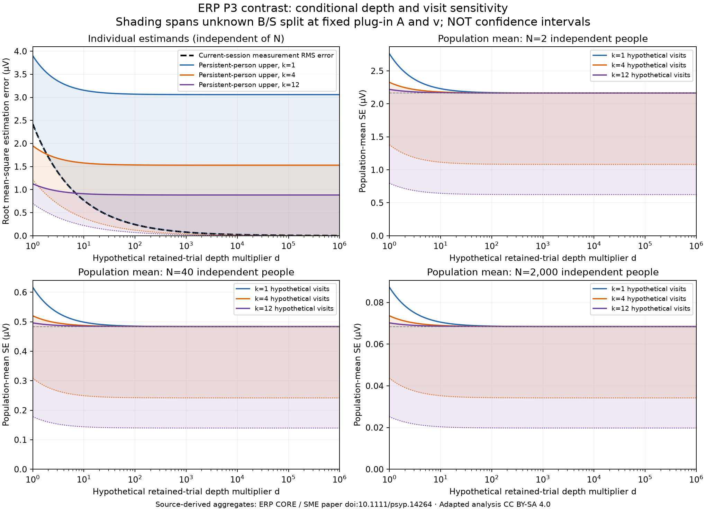

<!-- SPDX-FileCopyrightText: 2026 AniBench contributors -->
<!-- SPDX-License-Identifier: CC-BY-SA-4.0 -->
# ERP design sensitivity

This is a conditional sensitivity calculation for the ERP CORE P3 rare-minus-frequent mean-voltage contrast, not a forecast of biological saturation. Only the calibration aggregate JSON was read as numerical input; participant rows and source workbooks were not read or copied. The one observed baseline is 40 participants, one session and source retained trial schedule. Every alternative N, d or k combination is hypothetical. No study ranking, biological threshold, clinical claim or optimal allocation follows.



See all [27 tabulated scenarios](DESIGN_TABLE.md).

## Source and assumption

Source-derived report, table and figures are adaptations under **CC BY-SA 4.0**, attributed to **ERP CORE** and the authors of the [primary SME paper](https://doi.org/10.1111/psyp.14264). Original recording/contrast settings and aggregate provenance are documented in the [calibration report](REPORT.md). The OSF CC BY versus official project/bundled CC BY-SA discrepancy is retained; this artifact uses the more restrictive share-alike attribution. [The generated JSON](design-sensitivity.json) binds the exact aggregate input and executable by SHA-256, and carries the upstream source hashes. It uses a generic source filename and contains no input path.

Let A = 9.360227534862045 µV² be the estimated persistent-person plus session variance, and v = 5.859430882401938 µV² be the mean analytic contrast measurement variance **at the source retained trial schedule**. A is a method-of-moments estimate, not known biological variance. v is not the variance of one raw reading. The source mean retained counts are 30.525 rare and 139.9 frequent trials per person; counts differ between participants.

The hypothetical depth multiplier d scales *both* condition trial schedules proportionally, keeping the contrast operator, independent-trial noise and zero cross-condition error covariance unchanged. Only under this assumption does mean contrast noise become v/d. Thus d=1,000,000 means one million times the source schedule, not one million total readings. It is an extreme algebraic stress case, not a feasible recording proposal or evidence that noise laws persist over that duration. Integer scheduling, adaptation, fatigue, drift and serial dependence are not modeled.

## Separate estimands

For independent participants and independent session deviations, write A=B+S, with B≥0 and S≥0. Actual independent recording sessions would be needed to implement k visits; relabeling or resampling one session does not supply them. No repeated sessions were observed in this calibration.

| Estimand and estimator | Conditional error variance (µV²) |
|---|---|
| Current-session person state, estimated from that session | v/d |
| Persistent-person mean, estimated from k visits | S/k + v/(kd) |
| Population mean, estimated from N people and k visits | [B + S/k + v/(kd)]/N |

The persistent-person error is relative to the individual's own persistent mean; it does not include B as error. More participants do not improve this unshrunk person's estimate. More visits do not reduce measurement error for the state of one particular current session unless an additional state model is introduced. There is no proper-prior posterior or finite-task calibration bridge here.

Because one session identifies neither B nor S, vary S over [0,A], holding the **estimated** A and v fixed. This gives:

- Persistent-person variance: [v/(kd), A/k + v/(kd)].
- Population-mean variance: [(A/k + v/(kd))/N, (A + v/(kd))/N].

These are **identification ranges conditional on point estimates**, not confidence intervals, prediction intervals or uncertainty in A and v. Their endpoints correspond to different possible decompositions of the same A. For k=1 the population range collapses exactly, even though persistent-person uncertainty remains unidentified. Taking square roots preserves endpoint order and gives RMS estimation error or population SE in µV. The table includes variances and population SE; the figure shows roots.

## Checks and interpretation

The table contains exactly 27 combinations: N∈{2,40,2000}, d∈{1,4,1000000}, k∈{1,4,12}. At N=40,d=1,k=1, sqrt((A+v)/40) = **0.6168398985406177 µV**, exactly reproducing the source observed cohort-mean SE to floating-point tolerance. This is an algebraic consistency check, not independent calibration validation.

At N=2,k=1, increasing d without bound leaves population SE at sqrt(A/2), approximately **2.163 µV**. Current-session measurement RMS error tends to zero under the assumed noise law, while population uncertainty retains between-person/session sampling variation. For k=12 and N=2, the limiting population identification range is [sqrt(A/24),sqrt(A/2)], approximately **[0.625,2.163] µV**. More depth alone cannot identify which floor applies. At fixed k, persistent-person error tends to the interval [0,sqrt(A/k)]. These statements do not declare any finite design saturated.

The figure uses different vertical scales for the three population panels, with units and N printed on each. Shading is the range of admissible B/S decompositions, solid curves are upper bounds and dotted curves are lower bounds; k=1 population bounds coincide. The dashed gray population line is sqrt(A/N), the conservative infinite-depth floor. Black dashed curve in the individual panel is current-session measurement error. Population-panel visit labels say hypothetical visits.

## Unresolved uncertainty and scope

The calibration's exploratory participant-bootstrap intervals are not propagated here. A and v share observations and are dependent; combining their separate interval endpoints would not give a justified simultaneous confidence band. Trial-variance estimation uncertainty, serial dependence, cross-condition covariance, rejected-trial selection, window optimization on this cohort and transport to other people/devices/protocols remain unresolved. Scaling to N=2 or N=2000 assumes the same target population and average noise behavior; neither scenario is an observed dataset. The average v describes the cohort's heterogeneity in noise, not equal noise for every participant.

The observation model concerns this diagnostic contrast only. It establishes neither intervention causality nor neural reconstruction or treatment effects. Visits must be temporally and statistically defensible independent session units; money, duplicate files and duplicate trials cannot substitute for N or k. No cost model, general design optimum or universal neuro-modality requirement is supplied.

## Reproduction and validation

From the repository root, with Python and matplotlib installed, choose a new output directory:

```sh
python examples/calibration/erp_core/design_sensitivity.py --aggregates examples/calibration/erp_core/aggregate_results.json --out-dir build/erp-sensitivity
python -m pytest tests/test_erp_design_sensitivity.py
```

The algebra tests pass, including 108 algebra fixtures (four variance configurations × three N × three k × three d) each checked at three B/S splits, large-depth limits, participant scaling, the distinction between more visits and current-session precision, and rejection of invalid counts/variances without silent A truncation. The executable additionally asserts the observed baseline and emits 27 rows. PNG visually inspected: readable axes, units, uncertainty labels and attribution. Numerical artifacts are deterministic for unchanged source/code. Plot rendering also depends on the plotting library and fonts.
