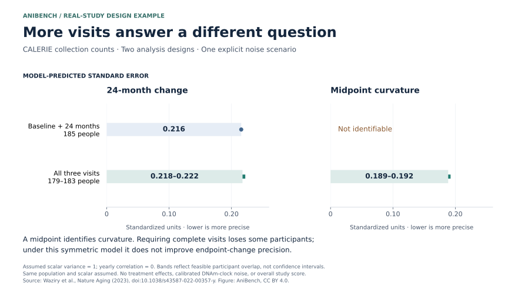

<!-- SPDX-FileCopyrightText: 2026 AniBench contributors -->
<!-- SPDX-License-Identifier: CC-BY-4.0 -->
# CALERIE: source-supported temporal and intervention geometry

This worked example compares two analysis designs from published CALERIE
collection counts using existing AniBench APIs. It demonstrates conditional
design precision, not treatment effects, calibrated biological information or a
complete AniBench study score. No participant data or article body is included.

## Run

From a checkout with AniBench installed:

```sh
python examples/design_geometry/calerie/replay.py --out calerie-replay
```

The output directory must be new. The frozen literal-fact manifest is sufficient
for this replay; the receipt records that original source bytes were not replayed.
To additionally verify a locally obtained public BioC snapshot:

```sh
python examples/design_geometry/calerie/replay.py \
  --source /path/to/PMC10148951.json --out calerie-source-verified
```

There is no automatic download. `source_manifest.json` names the primary article,
exact acquisition URL, response SHA-256, passage SHA-256 and JSON pointer. A source
refresh requires an explicit reviewed version change; altered bytes are rejected.
The source is [Waziry et al., Nature Aging (2023)](https://doi.org/10.1038/s43587-022-00357-y),
[primary full text](https://pmc.ncbi.nlm.nih.gov/articles/PMC10148951/).

## Source facts and derived support

The paragraph at `/0/documents/0/passages/5/text` reports DNA methylation sampling
at baseline, 12 and 24 months. There are 197 people with baseline and at least one
follow-up; change-analysis counts are 125 CR / 66 AL at 12 months and 117 CR /
68 AL at 24 months. These are endpoint-specific analysis denominators, not a
claim that all 197 have every observation.

The common-universe intersection bound for both follow-ups is **179–185** people.
Disjoint arm membership sharpens it to **179–183**: the maximum CR overlap is 117
and the maximum AL overlap is 66. The algorithm derives all 15 feasible paired
arm supports from the marginals and parent count; it does not hardcode bounds
or assume independent missingness. The original pooled bound remains in output.
These support intervals are not confidence intervals. They are feasible under a
**weaker common-parent-universe interpretation**, not a claim that the paper
establishes every support combination as possible. If the 197 are exactly the
union of the two change-analysis subsets, inclusion–exclusion instead gives
**179 complete cases exactly**, with five possible arm splits. The paper's
baseline-plus-follow-up wording supports considering that interpretation; assay
availability and change-analysis eligibility must coincide to make the equality.
Output also includes this explicit `union_complete_sensitivity`. The main replay
retains the conservative 15-support envelope rather than silently choosing a
source interpretation. Actual timestamps and exact individual joins remain
unavailable.

## Fixed comparison frame and explicit assumptions

Compare baseline + 24 months (117 CR / 68 AL) against complete three-timepoint
records over the feasible support envelope. Both share a two-year horizon,
reference population and two estimands: CR minus AL endpoint-change coefficient,
and CR minus AL midpoint-curvature coefficient. The observable is an explicitly
**illustrative standardized scalar derived from DNAm**, not an assertion that a
published clock has unit noise or a validated calibration.

Time in nominal years gives design columns `t/2` and `(t−1)^2`. Intercepts are
nuisance. `anibench.causal_v2.contrast_information` centers and range-normalizes
these columns using the supplied residual precision. The endpoint-change column
has range one in both designs; curvature has range one for three visits and zero
for endpoints alone. Thus the estimand units remain fixed across comparisons.
`anibench.information_v2.event_information` independently checks endpoint-change
information. No new core information solver is introduced.

The nine default sensitivity scenarios cross residual variances 0.25, 1 and 4 with
yearly correlations 0, 0.5 and 0.9. Covariance is
`R(t,s) = variance * rho^abs(t−s)`. These are hypothetical common models, not
estimated CALERIE assay covariance or exhaustive uncertainty bounds. Participants
are independent; both retained subsets are assumed exchangeable for the common
reference population; scalar definitions and arm mean trajectories are shared.
Post-treatment selection may violate this assumption. A causal interpretation
additionally needs consistency, no interference and retained-sample
exchangeability; initial randomization alone does not establish all of these.
The lower-level `evaluate` helper also accepts explicitly declared positive
variances and yearly correlations in [0,1), for unit and model sensitivity checks.
It retains the exact assumptions and comparison frame. Comparison envelopes
require every feasible support exactly once within each supplied model; omitted
or repeated supports are rejected.

For one arm of size `n`, endpoint-change variance is
`2 * variance * (1−rho²) / n`. With three visits, curvature variance is
`variance * (1.5−2rho+0.5rho²) / n`. Between-arm variances add. These separately
derived identities check API results. Time-reversal symmetry makes centered
linear and curvature directions information-orthogonal; the code checks this
numerically before using scalar reciprocals. Unidentified curvature is `null`,
not zero variance or a pseudoinverse result.

## What the example shows

At residual variance 1 and correlation 0:

| Analysis design | Endpoint-change variance | Curvature variance |
|---|---:|---:|
| Baseline + 24 months | 0.046505782 | Unidentifiable |
| All three visits | 0.047397047–0.049352082 | 0.035547786–0.037014061 |

Units are standardized-scalar-unit squared. Under this symmetric model the
midpoint adds no endpoint-change precision; requiring it loses complete cases.
It does enable a curvature question. More cadence therefore need not improve
every target. The displayed intervals concern support uncertainty inside one
fixed model, not confidence intervals, observed errors or biological rankings.

Outputs contain 144 source/model-bound requests, exact replay receipts and 36
chart rows. Shared comparisons require identical source, population, estimand and
unit IDs; different covariance scenarios remain separate. Receipts bind this
script, the existing API source files, Python and NumPy. Replay is deterministic
within the bound runtime and never overwrites an existing output directory.
Hashes establish integrity, not independent scientific approval.

## Publication figure



Reproduce the figure and all numerical receipts in a new directory:

```sh
python examples/design_geometry/calerie/plot.py --out calerie-figure
```

Add `--source /path/to/PMC10148951.json` to verify the original source snapshot.
The SVG contains its selected rows, source and implementation bindings in its
metadata; the accompanying PNG and `figure-metadata.json` use the same results.
Displayed standard errors are square roots of the conditional variances above.
The two questions have different meanings even though both use standardized
scalar units. The plot does not rank one question above the other.

The full protocol-capacity compiler also requires biological operators,
measurement covariance, lineage and broader causal/transport authority that this
source paragraph does not supply. This example does not fabricate a full study
packet or change existing benchmark gates. It needs no measured treatment benefit.
